# Monitor-RS Documentation

**Service-Aware Infrastructure Monitoring in Rust**

Welcome to the Monitor-RS documentation! This guide provides visualizations and an overview of the project architecture, deployment options, and usage patterns.

---

## 📊 Project Overview

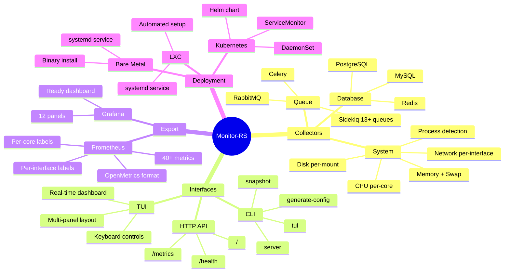

---

## 🏗️ Architecture

### System Architecture

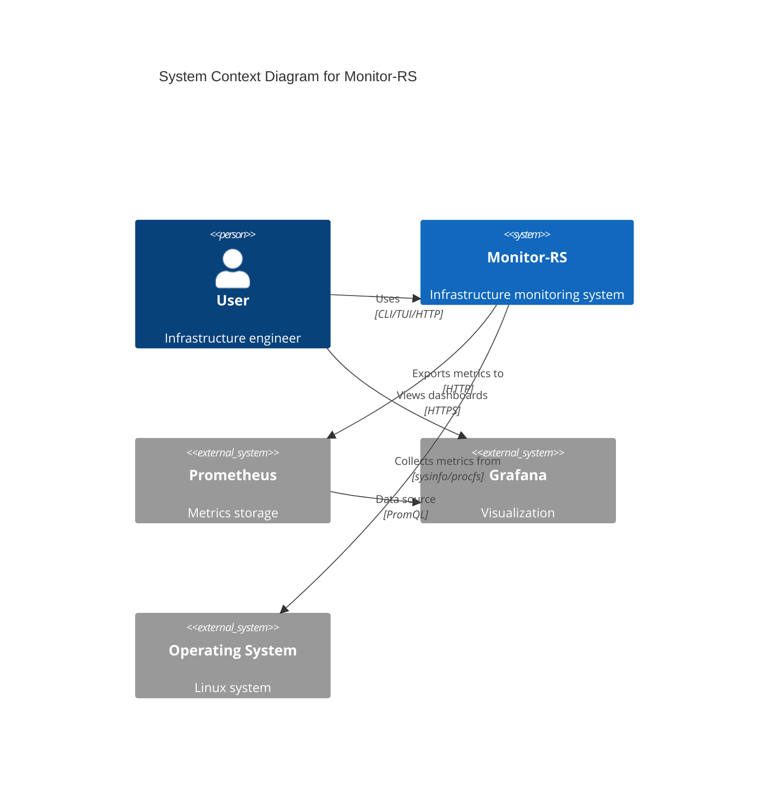

### Component Architecture

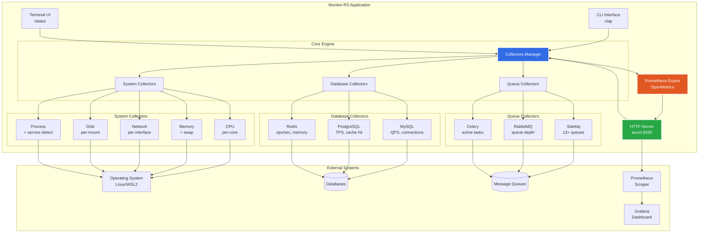

---

## 📦 Deployment Patterns

### Kubernetes Deployment

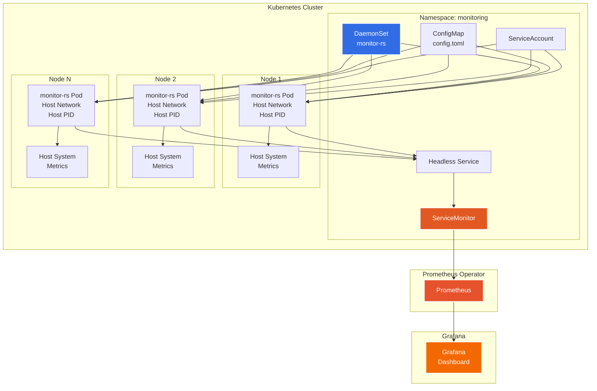

### LXC Deployment

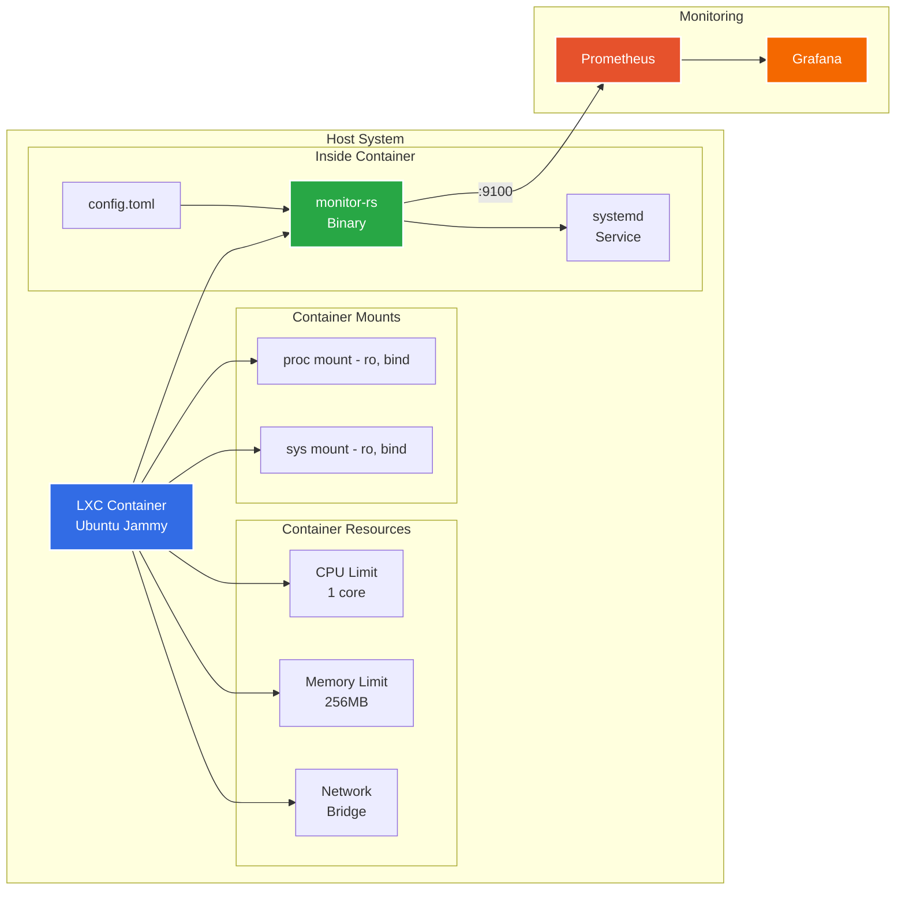

---

## 🔄 Data Collection Flow

### Metric Collection Pipeline

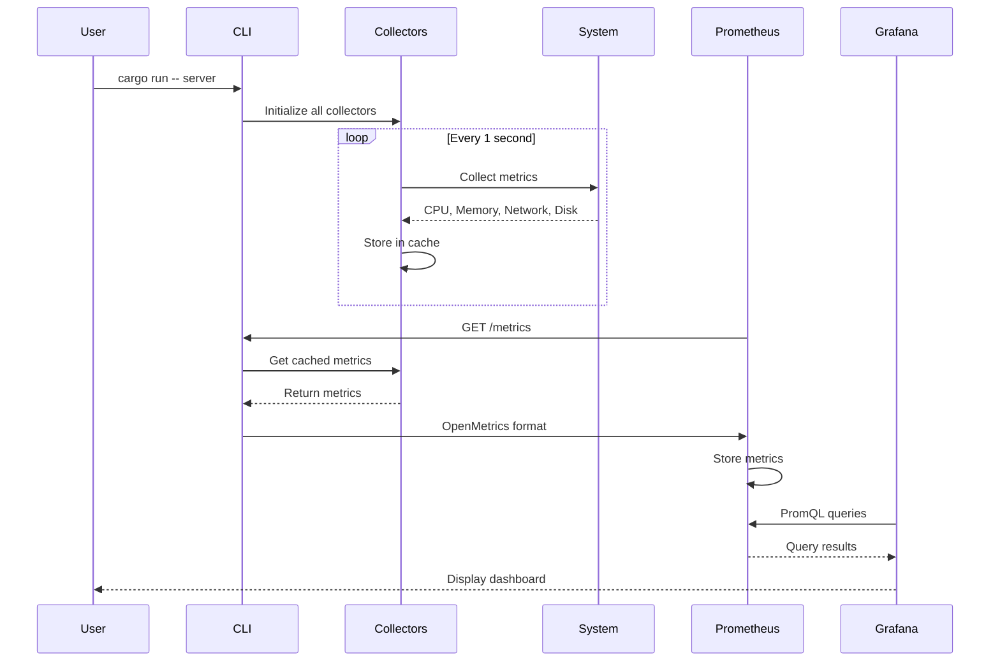

### TUI Update Flow

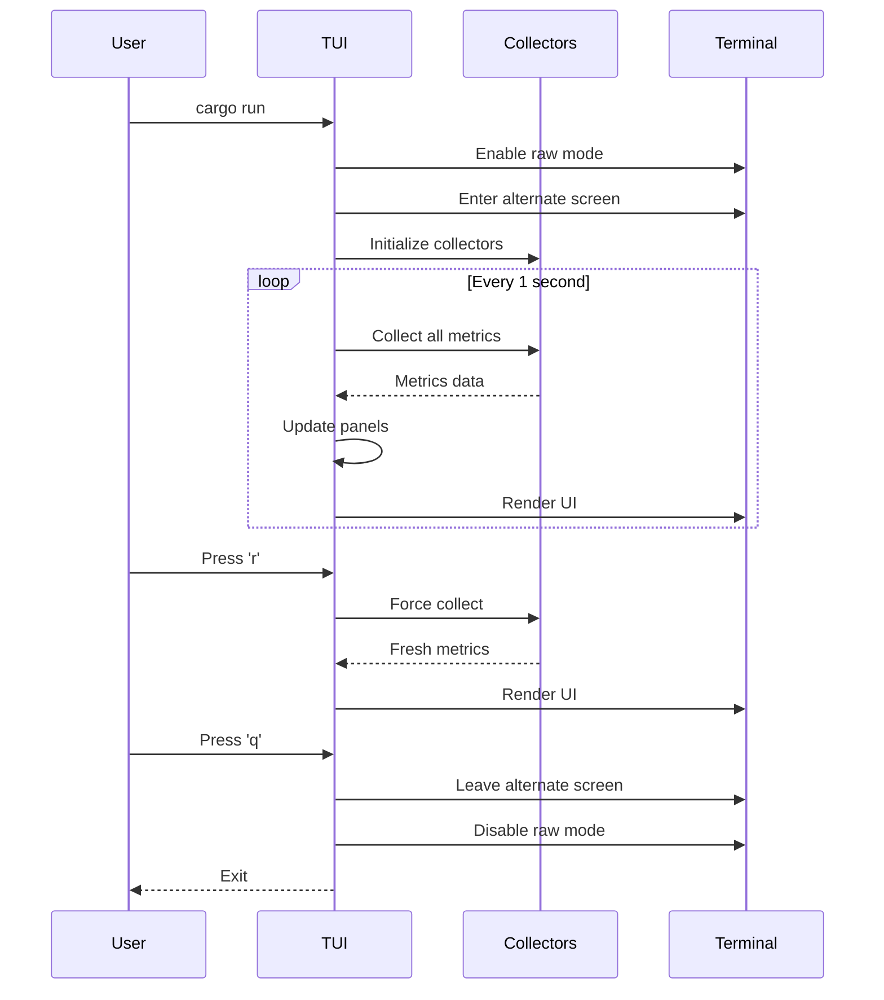

---

## 📈 Metrics Hierarchy

```mermaid
graph TD
    Root[Monitor-RS Metrics] --> System[System Metrics]
    Root --> Services[Service Metrics]

    System --> CPU[CPU]
    System --> Memory[Memory]
    System --> Network[Network]
    System --> Disk[Disk]
    System --> Process[Processes]

    CPU --> CPU1[cpu_usage_percent]
    CPU --> CPU2[cpu_cores_total]
    CPU --> CPU3[cpu_load_average]
    CPU --> CPU4[cpu_core_usage_percent]

    Memory --> MEM1[memory_total_bytes]
    Memory --> MEM2[memory_used_bytes]
    Memory --> MEM3[memory_usage_percent]
    Memory --> MEM4[swap_*]

    Network --> NET1[network_received_bytes_total]
    Network --> NET2[network_transmitted_bytes_total]
    Network --> NET3[network_*_rate_bytes_per_second]
    Network --> NET4[network_interface_*]

    Disk --> DISK1[disk_total_bytes]
    Disk --> DISK2[disk_used_bytes]
    Disk --> DISK3[disk_usage_percent]
    Disk --> DISK4[disk_mount_*]

    Process --> PROC1[processes_total]
    Process --> PROC2[processes_running]

    Services --> SVC[Service Metrics]
    SVC --> SVC1[service_process_count]
    SVC --> SVC2[service_cpu_usage_percent]
    SVC --> SVC3[service_memory_bytes]

    style Root fill:#326ce5,stroke:#fff,stroke-width:2px,color:#fff
    style System fill:#28a745,stroke:#fff,stroke-width:2px,color:#fff
    style Services fill:#e25822,stroke:#fff,stroke-width:2px,color:#fff
```

---

## 🎯 Use Case Scenarios

### Development Workflow

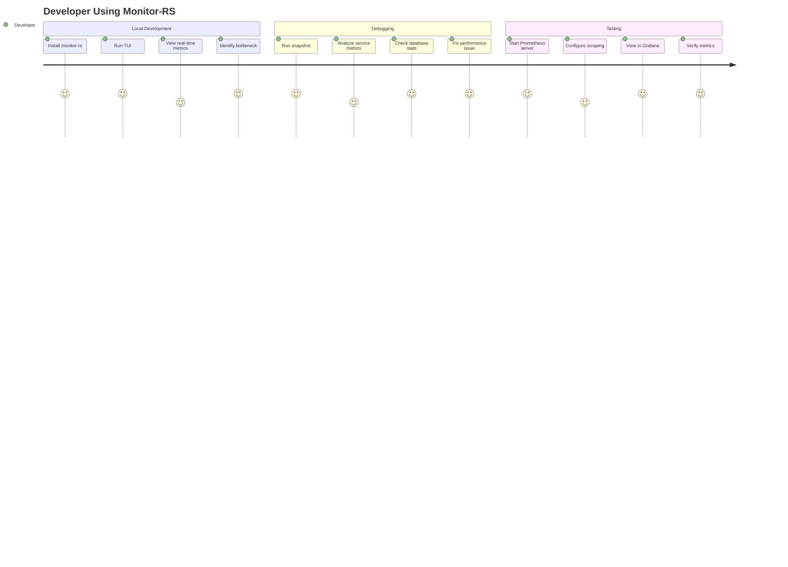

### Production Deployment

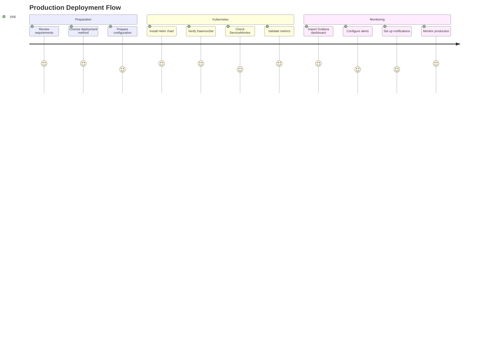

---

## 📊 Performance Characteristics

### Resource Usage

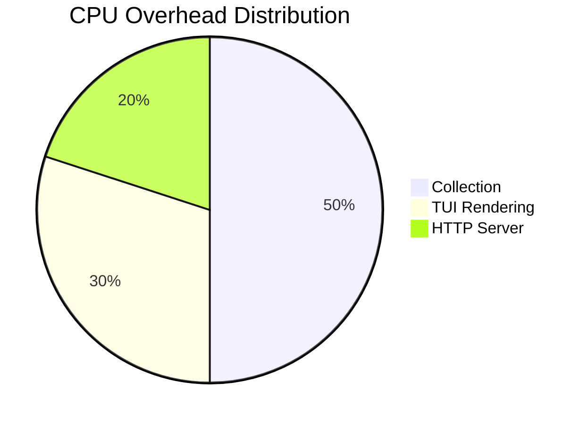

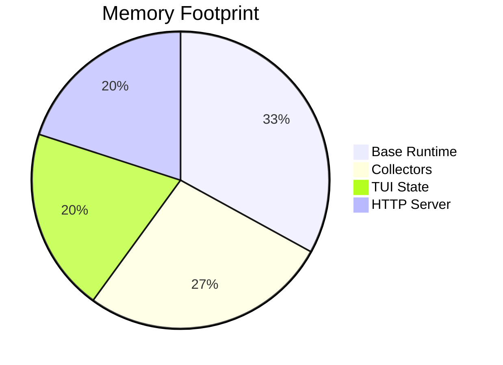

---

## 🔗 Integration Points

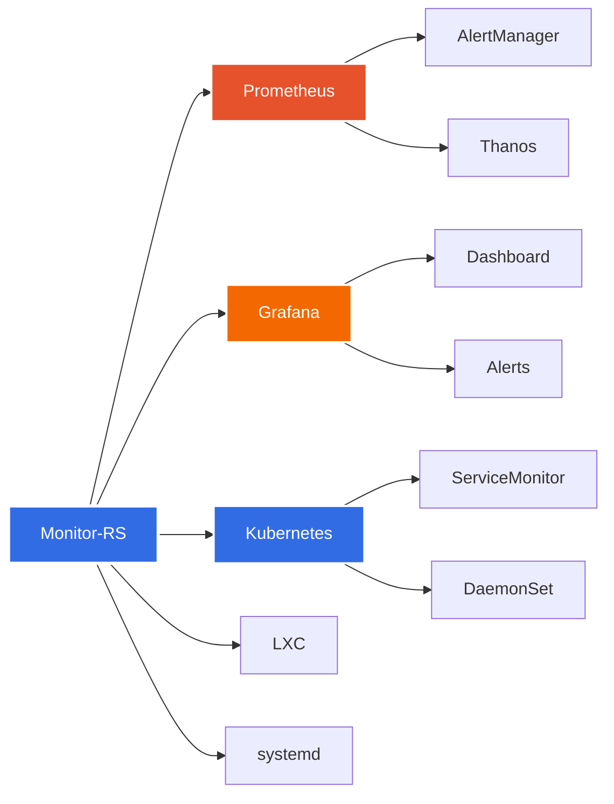

---

## 📚 Documentation Structure

```
docs/
├── README.md                    # This file (visualizations & overview)
├── INDEX.md                     # Documentation index
├── week1/                       # Week 1 implementation
│   ├── OVERVIEW.md             # Status overview
│   ├── COMPLETED.md            # Completed features
│   └── REMAINING.md            # Remaining work
├── guides/                      # User guides
│   └── QUICKSTART.md           # Quick start guide
├── architecture/                # Architecture docs (planned)
└── deployment/                  # Deployment guides (planned)

Root Documentation:
├── README.md                    # Main project README (900+ lines)
├── IMPLEMENTATION_SUMMARY.md    # Complete implementation details
├── CHANGELOG.md                 # Version history
└── deploy/                      # Deployment configs
    ├── kubernetes/              # K8s Helm chart + guide
    └── lxc/                     # LXC config + guide
```

---

## 🚀 Quick Links

- **[Main README](../README.md)** - Project overview and quick start
- **[Implementation Summary](../IMPLEMENTATION_SUMMARY.md)** - Complete Week 1 details
- **[CHANGELOG](../CHANGELOG.md)** - Version history
- **[Kubernetes Deployment](../deploy/kubernetes/README.md)** - K8s guide
- **[LXC Deployment](../deploy/lxc/README.md)** - LXC guide
- **[Quick Start Guide](guides/QUICKSTART.md)** - Get started in 5 minutes

---

## 📞 Support

- **Issues:** [GitHub Issues](https://github.com/ericgitangu/perf-monitor-rs/issues)
- **Discussions:** [GitHub Discussions](https://github.com/ericgitangu/perf-monitor-rs/discussions)
- **Repository:** [GitHub](https://github.com/ericgitangu/perf-monitor-rs)

---

*Monitor-RS - Service-aware infrastructure monitoring in Rust 🦀*

*Built with ❤️ by [Eric Gitangu](https://github.com/ericgitangu)*
