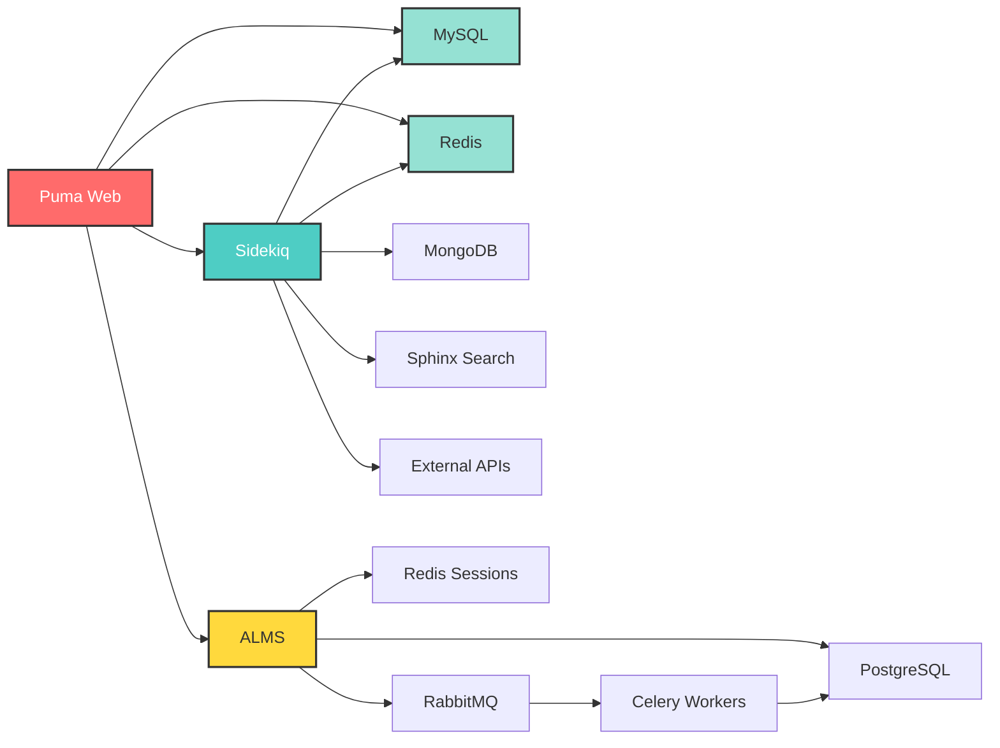

# Application Performance Monitoring (APM) Guide

This guide covers comprehensive infrastructure monitoring for multi-service architectures, including inter-service dependencies, performance bottlenecks, and observability best practices.

## Table of Contents

- [Overview](#overview)
- [Architecture Monitoring](#architecture-monitoring)
- [Service Dependencies](#service-dependencies)
- [Performance Bottleneck Detection](#performance-bottleneck-detection)
- [Database Monitoring](#database-monitoring)
- [Queue Monitoring](#queue-monitoring)
- [Web Server Monitoring](#web-server-monitoring)
- [Search Engine Monitoring](#search-engine-monitoring)
- [Alerting Strategies](#alerting-strategies)
- [Troubleshooting Workflows](#troubleshooting-workflows)
- [Best Practices](#best-practices)

---

## Overview

Monitor-RS provides **service-aware infrastructure monitoring** that goes beyond basic system metrics. It understands:

- **Service relationships** - How MySQL, Redis, Sidekiq, and Puma interact
- **Performance patterns** - Normal vs. anomalous behavior
- **Bottleneck propagation** - How one slow service affects others
- **Resource contention** - When services compete for CPU, memory, or I/O

### The Complete Stack

```
┌─────────────────── Application Layer ──────────────────┐
│                                                         │
│  ┌──────────┐   ┌──────────┐   ┌──────────┐          │
│  │  Puma 1  │   │  Puma 2  │   │  Puma 3  │          │
│  │ (Rails)  │   │ (Rails)  │   │ (Rails)  │          │
│  └────┬─────┘   └────┬─────┘   └────┬─────┘          │
│       │              │              │                  │
└───────┼──────────────┼──────────────┼──────────────────┘
        │              │              │
┌───────┴──────────────┴──────────────┴──────────────────┐
│                Background Jobs Layer                    │
│                                                         │
│  ┌─────────────────────────────────────────────────┐  │
│  │  Sidekiq Workers (25+ queues)                   │  │
│  │  - Payment processing                            │  │
│  │  - Notifications                                 │  │
│  │  - Analytics                                     │  │
│  └─────────────────────────────────────────────────┘  │
│                                                         │
└─────────────────────────────────────────────────────────┘
        │              │              │
┌───────┴──────────────┴──────────────┴──────────────────┐
│                   Data Layer                            │
│                                                         │
│  ┌──────────┐  ┌───────────┐  ┌────────┐  ┌────────┐ │
│  │  MySQL   │  │  MongoDB  │  │ Redis  │  │ Sphinx │ │
│  │  8.0.18  │  │    4.2    │  │   3    │  │ 5.6.0  │ │
│  └──────────┘  └───────────┘  └────────┘  └────────┘ │
│                                                         │
└─────────────────────────────────────────────────────────┘
        │              │              │
┌───────┴──────────────┴──────────────┴──────────────────┐
│              External Services Layer                    │
│                                                         │
│  ┌──────────┐  ┌──────────────┐  ┌──────────────────┐ │
│  │   ALMS   │  │  MTN MoMo    │  │  Airtel Money   │ │
│  │ (FastAPI)│  │  Gateway     │  │  Gateway        │ │
│  └──────────┘  └──────────────┘  └──────────────────┘ │
│                                                         │
└─────────────────────────────────────────────────────────┘
```

---

## Architecture Monitoring

### Multi-Service Deployment

For a complete infrastructure (e.g., solarhub + momoep + moto + mese + ALMS), run multiple monitor-rs instances:

```bash
# Terminal 1 - Solarhub monitoring (port 9090)
monitor-rs --config examples/infrastructure/solarhub-config.toml

# Terminal 2 - Momoep monitoring (port 9091)
monitor-rs --config examples/infrastructure/momoep-config.toml

# Terminal 3 - Moto monitoring (port 9092)
monitor-rs --config examples/infrastructure/moto-config.toml

# Terminal 4 - Mese monitoring (port 9093)
monitor-rs --config examples/infrastructure/mese-config.toml

# Terminal 5 - ALMS monitoring (port 9094)
monitor-rs --config examples/infrastructure/accounts-alms-config.toml
```

### Prometheus Aggregation

Configure Prometheus to scrape all services:

```yaml
# prometheus.yml
scrape_configs:
  - job_name: 'solarhub'
    scrape_interval: 15s
    static_configs:
      - targets: ['localhost:9090']
        labels:
          service: 'solarhub'
          environment: 'production'

  - job_name: 'momoep'
    scrape_interval: 10s  # More frequent for payment platform
    static_configs:
      - targets: ['localhost:9091']
        labels:
          service: 'momoep'
          environment: 'production'
          critical: 'true'

  - job_name: 'moto'
    scrape_interval: 15s
    static_configs:
      - targets: ['localhost:9092']

  - job_name: 'mese'
    scrape_interval: 15s
    static_configs:
      - targets: ['localhost:9093']

  - job_name: 'alms'
    scrape_interval: 15s
    static_configs:
      - targets: ['localhost:9094']
        labels:
          service: 'alms'
          type: 'microservice'
```

### Cross-Service Queries

**Find all unhealthy services:**
```promql
up{job=~"solarhub|momoep|moto|mese|alms"} == 0
```

**Total memory usage across all services:**
```promql
sum(memory_used_bytes{job=~"solarhub|momoep|moto|mese|alms"})
```

**Services with high CPU:**
```promql
cpu_usage_percent{job=~"solarhub|momoep|moto|mese|alms"} > 80
```

---

## Service Dependencies

### Dependency Graph

Understanding how services depend on each other is critical for troubleshooting:



### Monitoring Dependency Health

**1. Check if all dependencies are available:**

```promql
# MySQL availability across all services
mysql_available{instance=~".+"} == 1

# Redis availability
redis_available{instance=~".+"} == 1

# MongoDB availability
mongodb_available{instance=~".+"} == 1
```

**2. Detect cascade failures:**

If MySQL is slow, it affects both Puma and Sidekiq:

```promql
# MySQL slow queries
mysql_slow_queries_per_second > 10

# Combined with Puma backlog
puma_backlog > 50

# And Sidekiq queue latency
sidekiq_queue_latency_seconds > 300
```

This pattern indicates **database bottleneck propagating to app layer**.

---

## Performance Bottleneck Detection

### Common Bottleneck Patterns

#### 1. **Database Connection Saturation**

**Symptoms:**
- High connection count
- Slow query rate increases
- Application timeouts

**Detection Query:**
```promql
# Connection usage over 80%
(mysql_connections_current / mysql_connections_max) * 100 > 80
```

**Action:**
- Increase `max_connections` in MySQL
- Review connection pool settings in Rails (`database.yml`)
- Identify connection leaks

#### 2. **Redis Memory Eviction**

**Symptoms:**
- Cache hit ratio drops
- Evicted keys increasing
- Application slower due to database hits

**Detection Query:**
```promql
# Redis evicting keys
rate(redis_evicted_keys_total[5m]) > 100
```

**Action:**
- Increase Redis `maxmemory`
- Review eviction policy (`allkeys-lru` vs `volatile-lru`)
- Add Redis replicas

#### 3. **Sidekiq Queue Backup**

**Symptoms:**
- Queue depth increasing
- Job latency high
- Background tasks delayed

**Detection Query:**
```promql
# Payment queue latency over 1 minute
sidekiq_queue_latency_seconds{queue="payment_initiation"} > 60
```

**Action:**
- Add more Sidekiq workers
- Increase concurrency (`sidekiq -c 25`)
- Split critical queues to dedicated workers

#### 4. **Puma Thread Starvation**

**Symptoms:**
- Backlog increasing
- Response times slow
- 503 errors

**Detection Query:**
```promql
# Puma backlog over threshold
puma_backlog > 30
```

**Action:**
- Increase `max_threads` in `config/puma.rb`
- Add more Puma workers
- Scale horizontally (more Puma instances)

#### 5. **Sphinx Query Slowdown**

**Symptoms:**
- Search queries slow
- Queries per second drops
- User-facing search delays

**Detection Query:**
```promql
# Sphinx average query time over 500ms
sphinx_queries_avg_time_ms > 500
```

**Action:**
- Rebuild Sphinx indexes
- Optimize index configuration
- Add more Sphinx workers
- Review query patterns

---

## Database Monitoring

### MySQL Metrics

**Key Performance Indicators:**

| Metric | Healthy Range | Critical Threshold | Action |
|--------|---------------|-------------------|--------|
| Connections % | < 70% | > 85% | Increase max_connections |
| Slow Queries/sec | < 5 | > 10 | Optimize queries, add indexes |
| Replication Lag | < 5s | > 30s | Check network, disk I/O |
| Buffer Pool Hit % | > 95% | < 85% | Increase innodb_buffer_pool_size |
| QPS | Varies | Sudden drop | Check slow queries, locks |

**Prometheus Queries:**

```promql
# Connection saturation
(mysql_connections_current / mysql_connections_max) * 100

# Buffer pool efficiency
(mysql_buffer_pool_hits / mysql_buffer_pool_reads) * 100

# Replication lag (critical for data consistency)
mysql_replication_lag_seconds

# Slow query trend
rate(mysql_slow_queries_total[5m])
```

**Grafana Alerts:**

```yaml
- alert: MySQLConnectionSaturation
  expr: (mysql_connections_current / mysql_connections_max) * 100 > 85
  for: 5m
  labels:
    severity: warning
  annotations:
    summary: "MySQL connection pool saturated on {{ $labels.instance }}"

- alert: MySQLReplicationLag
  expr: mysql_replication_lag_seconds > 30
  for: 2m
  labels:
    severity: critical
  annotations:
    summary: "MySQL replica lagging {{ $value }}s on {{ $labels.instance }}"
```

### MongoDB Metrics

**Key Performance Indicators:**

| Metric | Healthy Range | Critical Threshold | Action |
|--------|---------------|-------------------|--------|
| Connections % | < 75% | > 90% | Add replicas, review connection pooling |
| Ops/sec | Varies | Sudden spike | Check for expensive queries |
| Lock % | < 5% | > 20% | Review write-heavy operations |
| Document Count | Monitored | Rapid growth | Archive old data |

**Prometheus Queries:**

```promql
# Operations per second
mongodb_ops_per_second

# Lock contention
mongodb_lock_percent > 10

# Connection usage
(mongodb_current_connections / mongodb_available_connections) * 100
```

### Redis Metrics

**Key Performance Indicators:**

| Metric | Healthy Range | Critical Threshold | Action |
|--------|---------------|-------------------|--------|
| Memory % | < 80% | > 90% | Add memory, review eviction policy |
| Hit Ratio | > 90% | < 70% | Review cache strategy |
| Evicted Keys/sec | < 50 | > 100 | Increase memory |
| Connected Clients | Varies | Near max | Review connection handling |

**Prometheus Queries:**

```promql
# Cache hit ratio
(redis_keyspace_hits / (redis_keyspace_hits + redis_keyspace_misses)) * 100

# Memory pressure
(redis_memory_used_bytes / redis_memory_max_bytes) * 100

# Eviction rate
rate(redis_evicted_keys_total[5m])
```

---

## Queue Monitoring

### Sidekiq Monitoring

**Critical Metrics:**

1. **Queue Latency** - Time between job enqueue and execution
2. **Queue Depth** - Number of pending jobs
3. **Failed Jobs** - Jobs that threw exceptions
4. **Dead Jobs** - Jobs that exceeded retry limit
5. **Busy Workers** - Active job execution

**Payment Queue Monitoring (Momoep):**

```promql
# Payment initiation latency (must be < 60s)
sidekiq_queue_latency_seconds{queue="payment_initiation",service="momoep"} > 60

# Payment settlement queue depth
sidekiq_queue_depth{queue="payment_settlement",service="momoep"}

# Failed payment jobs (critical!)
rate(sidekiq_failed_jobs_total{queue=~"payment.*",service="momoep"}[5m])
```

**Alerting for Payment Queues:**

```yaml
- alert: PaymentQueueLatency
  expr: sidekiq_queue_latency_seconds{queue=~"payment.*",service="momoep"} > 60
  for: 1m
  labels:
    severity: critical
    team: payments
  annotations:
    summary: "Payment queue {{ $labels.queue }} delayed {{ $value }}s"
    runbook: "Check Sidekiq workers, Redis health, and MySQL connections"

- alert: PaymentJobFailures
  expr: rate(sidekiq_failed_jobs_total{queue=~"payment.*"}[5m]) > 0.1
  for: 2m
  labels:
    severity: critical
    team: payments
  annotations:
    summary: "Payment jobs failing at {{ $value }}/sec on {{ $labels.queue }}"
```

**Sidekiq Worker Scaling:**

```bash
# Check queue latency
curl http://localhost:9091/metrics | grep sidekiq_queue_latency

# If latency > 300s, add more workers:
bundle exec sidekiq -c 25 -q payment_critical -q payment_high

# For specialized queues:
bundle exec sidekiq -c 10 -q fraud_detection
bundle exec sidekiq -c 10 -q payment_settlement
```

### Celery Monitoring (ALMS)

**Critical Metrics:**

1. **Task Execution Time**
2. **Task Success/Failure Rate**
3. **Worker Utilization**
4. **Queue Lengths**

**Prometheus Queries:**

```promql
# Celery task rate
rate(celery_tasks_total{service="alms"}[5m])

# Task failure rate
rate(celery_tasks_failed_total{service="alms"}[5m])

# Queue depth
celery_queue_length{queue="account_creation",service="alms"}
```

---

## Web Server Monitoring

### Puma Metrics

**Critical Metrics:**

1. **Backlog** - Requests waiting for thread availability
2. **Thread Pool Usage** - running / max_threads ratio
3. **Worker Status** - booted vs. old workers
4. **Requests Count** - Total processed requests

**Health Indicators:**

| Metric | Healthy | Warning | Critical |
|--------|---------|---------|----------|
| Backlog | 0-10 | 10-50 | > 50 |
| Thread Usage % | < 70% | 70-90% | > 90% |
| Workers Booted | All | Some | None |

**Prometheus Queries:**

```promql
# Puma backlog (critical for latency)
puma_backlog > 30

# Thread pool saturation
(puma_running_threads / puma_max_threads) * 100 > 90

# Workers not booted (deployment issue)
puma_workers - puma_booted_workers > 0
```

**Puma Scaling Decision Tree:**

```
Is backlog > 50?
├─ YES → High traffic or slow requests
│   ├─ Check thread usage
│   │   ├─ Usage > 90% → Increase max_threads OR add workers
│   │   └─ Usage < 70% → Slow downstream (check MySQL, Redis)
│   └─ Add more Puma instances
└─ NO → System healthy
```

**Tuning Example:**

```ruby
# config/puma.rb

# Before (low throughput):
threads 5, 10
workers 2

# After (optimized for load):
threads 5, 20      # More threads per worker
workers 4          # More worker processes

# For momoep (high payment traffic):
threads 5, 25
workers 6
```

---

## Search Engine Monitoring

### ThinkingSphinx (Sphinx 5.6.0)

**Critical Metrics:**

1. **Queries Per Second** - Search throughput
2. **Average Query Time** - Search latency
3. **Index Document Count** - Data freshness
4. **Index Size** - Storage usage
5. **Worker Threads** - Concurrency

**Prometheus Queries:**

```promql
# Sphinx query performance
sphinx_queries_avg_time_ms > 500

# Query throughput
sphinx_queries_per_second

# Index health
sphinx_index_document_count{index="customers_core"}
```

**Sphinx Performance Troubleshooting:**

**Symptom: Slow search queries (> 500ms)**

```bash
# 1. Check Sphinx status
mysql -h sphinx.solarhub.internal -P 9306

SHOW STATUS;
# Look for: queries_wall, workers_total

# 2. Check index status
SHOW TABLES;
SHOW INDEX customers_core STATUS;

# 3. Rebuild indexes if stale
cd /path/to/solarhub
RAILS_ENV=production bundle exec rake ts:rebuild
```

---

## Alerting Strategies

### Severity Levels

**Critical (Page On-Call)**
- Payment queue latency > 60s
- Database replication lag > 30s
- Service availability = 0
- Puma backlog > 100

**Warning (Notify Team)**
- Connection usage > 80%
- Queue latency > 300s
- Slow queries > 10/sec
- Cache hit ratio < 70%

**Info (Log)**
- Connection usage > 70%
- Queue latency > 180s
- Disk usage > 80%

### Alert Routing

**By Service:**

```yaml
route:
  receiver: 'default'
  group_by: ['service', 'severity']
  routes:
    - match:
        service: momoep
        severity: critical
      receiver: 'payment-oncall'
      continue: false

    - match:
        service: alms
        severity: critical
      receiver: 'accounts-team'

    - match:
        severity: warning
      receiver: 'slack-engineering'
```

---

## Troubleshooting Workflows

### Workflow 1: Slow Application Response

**Step 1: Check Puma**
```promql
puma_backlog{service="solarhub"} > 50
```
- **If YES:** Scale Puma (add workers/threads)
- **If NO:** Continue to Step 2

**Step 2: Check Database**
```promql
mysql_slow_queries_per_second{instance="solarhub-mysql"} > 10
```
- **If YES:** Identify slow queries, add indexes
- **If NO:** Continue to Step 3

**Step 3: Check Redis**
```promql
(redis_keyspace_hits / (redis_keyspace_hits + redis_keyspace_misses)) * 100 < 70
```
- **If YES:** Cache misses causing database load
- **If NO:** Continue to Step 4

**Step 4: Check External Services**
```promql
http_request_duration_seconds{service="alms"} > 5
```
- **If YES:** ALMS API slow, investigate ALMS service
- **If NO:** Check network, logs

### Workflow 2: Payment Job Delays

**Step 1: Check Queue Latency**
```promql
sidekiq_queue_latency_seconds{queue="payment_initiation"} > 60
```
- **If YES:** Continue investigation
- **If NO:** False alarm

**Step 2: Check Sidekiq Workers**
```promql
sidekiq_busy_workers / sidekiq_total_workers
```
- **If > 0.9:** Add workers
- **If < 0.9:** Continue to Step 3

**Step 3: Check Redis (Sidekiq backend)**
```promql
redis_memory_usage_percent{database="1"} > 90
```
- **If YES:** Redis memory full, evicting queue data
- **If NO:** Continue to Step 4

**Step 4: Check Downstream Services**
- MySQL connections saturated?
- External API (MTN MoMo) slow?
- Network issues?

---

## Best Practices

### 1. **Baseline Your Metrics**

Establish normal ranges for each service:

```promql
# Record 95th percentile over 7 days
quantile_over_time(0.95, mysql_queries_per_second[7d])
```

Alert when metrics exceed baseline by 2x:

```promql
mysql_queries_per_second > 2 * quantile_over_time(0.95, mysql_queries_per_second[7d])
```

### 2. **Monitor Rate of Change**

Sudden changes often indicate issues:

```promql
# Sudden spike in connections
deriv(mysql_connections_current[5m]) > 10
```

### 3. **Correlate Metrics Across Services**

Use Grafana to create dashboards showing:
- Puma backlog + MySQL slow queries + Redis hit ratio
- Sidekiq latency + MySQL connections + Redis memory
- ALMS response time + PostgreSQL connections + RabbitMQ queue depth

### 4. **Test Alert Fatigue**

Review alert frequency weekly:

```bash
# Count alerts per day
promtool query instant http://localhost:9090 \
  'sum(ALERTS{alertstate="firing"}) by (alertname)'
```

Tune thresholds to reduce noise.

### 5. **Document Runbooks**

Every alert should have a runbook:

```yaml
- alert: MySQLConnectionSaturation
  annotations:
    runbook: |
      1. Check current connections: SHOW PROCESSLIST;
      2. Identify long-running queries
      3. Kill blocking queries: KILL <thread_id>;
      4. Increase max_connections if persistent
```

### 6. **Automate Scaling**

For Kubernetes deployments:

```yaml
# HorizontalPodAutoscaler for Sidekiq
apiVersion: autoscaling/v2
kind: HorizontalPodAutoscaler
metadata:
  name: sidekiq-payment
spec:
  scaleTargetRef:
    apiVersion: apps/v1
    kind: Deployment
    name: sidekiq-payment
  minReplicas: 2
  maxReplicas: 10
  metrics:
  - type: External
    external:
      metric:
        name: sidekiq_queue_latency_seconds
        selector:
          matchLabels:
            queue: payment_initiation
      target:
        type: Value
        value: "60"
```

---

## Summary

Monitor-RS provides comprehensive infrastructure monitoring covering:

- **14 service collectors** (MySQL, PostgreSQL, Redis, MongoDB, Sphinx, Puma, Sidekiq, Celery, RabbitMQ)
- **5 production examples** (solarhub, momoep, moto, mese, ALMS)
- **50+ metrics** exported to Prometheus
- **Service dependency tracking** for bottleneck detection
- **Performance alerting** with runbook automation

**Next Steps:**

1. Deploy monitor-rs for each service
2. Configure Prometheus scraping
3. Import Grafana dashboards
4. Set up alerting rules
5. Document baseline metrics
6. Create runbooks for common issues

**Related Documentation:**

- [Production Infrastructure Examples](../../examples/infrastructure/README.md)
- [Week 1 Implementation Summary](../summary.md)
- [Docker Compose Guide](../../examples/docker-compose/README.md)
